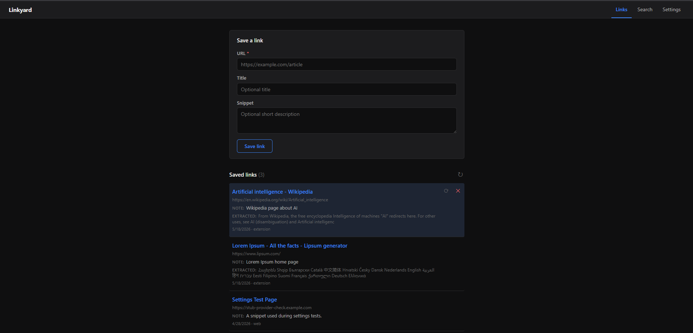
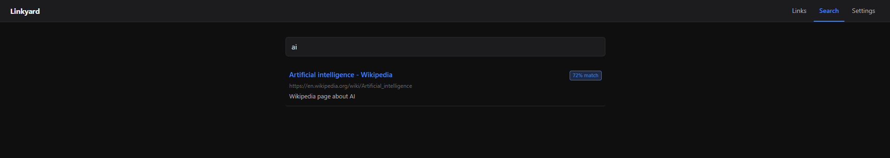
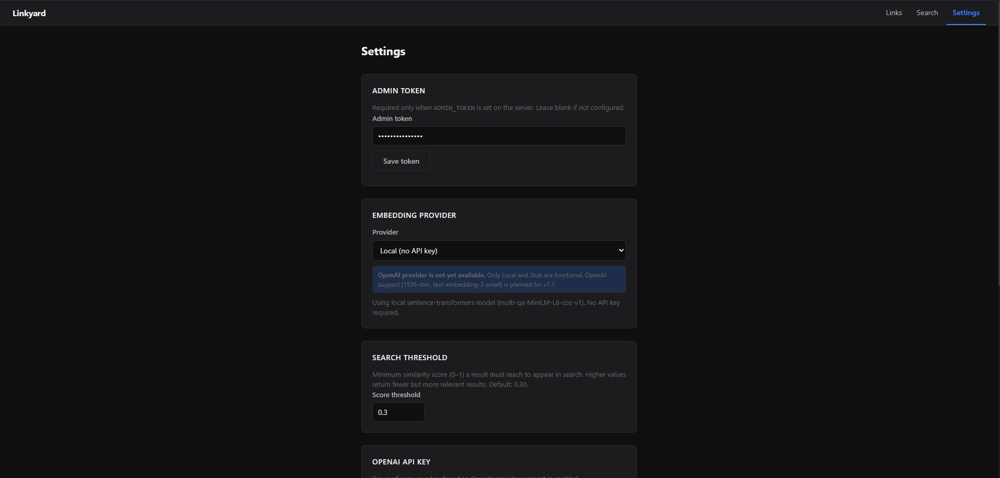
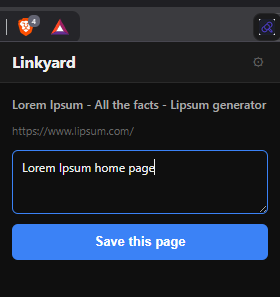

# Linkyard

Linkyard is a self-hosted semantic bookmarking app. Save URLs through a browser extension or the web UI, then search your collection by meaning — not just keywords. Links are embedded using a local sentence-transformer model (no external API required by default) and stored in Postgres with pgvector.

| | | |
|---|---|---|
|  |  |  |
| Links view | Semantic search | Settings |

<p align="center">
  
</p>

---

## Try it with sample data

Want searchable content from the first launch? Set `DEMO_SEED=true` in `.env` before `make up` and the backend pre-loads ~40 diverse links (programming, ML, design, philosophy, science) on first boot, so semantic search returns meaningful results immediately. Try queries like *"functional programming"*, *"how memory works"*, or *"design heuristics"*. The loader is idempotent — it no-ops once your database has any links — so it's safe to leave on.

Continue with [Quick start](#quick-start) below to get going.

---

## Prerequisites

- [Docker](https://docs.docker.com/get-docker/) and Docker Compose v2
- Chrome or Chromium (for the browser extension)

---

## Quick start

1. Clone the repository.

   ```bash
   git clone <repo-url> linkyard
   cd linkyard
   ```

2. Create your environment file and set a strong admin token.

   ```bash
   cp .env.example .env
   ```

   Open `.env` and set `ADMIN_TOKEN` to a random secret:

   ```bash
   openssl rand -hex 32
   ```

3. Build the image, start services, and run migrations.

   ```bash
   make build && make up && make migrate
   ```

4. Confirm the backend is running.

   ```bash
   curl http://localhost:8000/healthz
   ```

   You should get a `200 OK` response.

5. Load the extension (see next section).

---

## Load the extension

1. Open Chrome and navigate to `chrome://extensions`.
2. Enable **Developer mode** (top-right toggle).
3. Click **Load unpacked** and select the `extension/` directory in this repo.
4. Click the Linkyard icon in the toolbar, then open the options page (gear icon).
5. Set the backend URL to `http://localhost:8000` and save.

The popup will now let you save the current tab to Linkyard with an optional note.

---

## Configuration

All runtime configuration is set via environment variables in `.env`. The values below are the ones most likely to need changes.

| Variable             | Default                        | Description                                                                                    |
|----------------------|--------------------------------|------------------------------------------------------------------------------------------------|
| `ADMIN_TOKEN`        | *(empty)*                      | Bearer token for `/settings` endpoints. Generate with `openssl rand -hex 32` before go-live.  |
| `CORS_ORIGIN_REGEX`  | `chrome-extension://[a-p]{32}` | Regex matched against the `Origin` header. Pin to your extension's ID before go-live (find it on `chrome://extensions` after loading unpacked). |
| `EMBEDDING_PROVIDER` | `local`                        | `local` (sentence-transformers) or `openai`.                                                   |
| `EMBEDDING_DIM`      | `384`                          | Must match the model output dimension. `local` = 384, OpenAI `text-embedding-3-small` = 1536.  |
| `DEMO_SEED`          | `false`                        | When `true`, the backend pre-loads ~40 example links on first boot if the database is empty. Safe to leave on; the loader no-ops once links exist. |

> Before exposing the backend publicly, set `CORS_ORIGIN_REGEX` to
> `chrome-extension://<your-exact-extension-id>` to prevent other extensions from calling your backend.
> Your extension ID is shown on `chrome://extensions` after loading unpacked.

---

## Makefile commands

| Command        | Description                                          |
|----------------|------------------------------------------------------|
| `make build`   | Build the backend Docker image.                      |
| `make up`      | Start all services in detached mode.                 |
| `make down`    | Stop all services.                                   |
| `make migrate` | Run Alembic migrations inside the backend container. |
| `make logs`    | Tail backend logs (Ctrl-C to stop).                  |

---

## First search

On first save, the local embedding model (`multi-qa-MiniLM-L6-cos-v1`, ~90 MB) downloads automatically — this may take a minute. Subsequent saves are fast.

If you switch `EMBEDDING_PROVIDER` after saving links, go to the Settings tab in the web UI and click **Re-embed all links** to rebuild embeddings with the new model.
